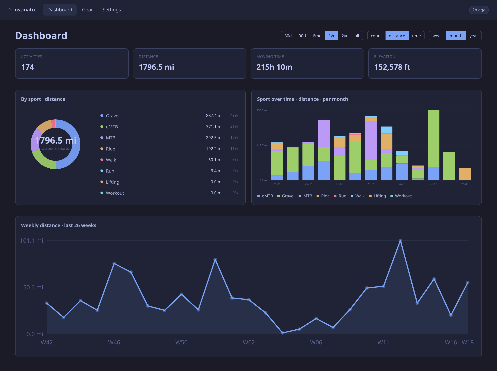
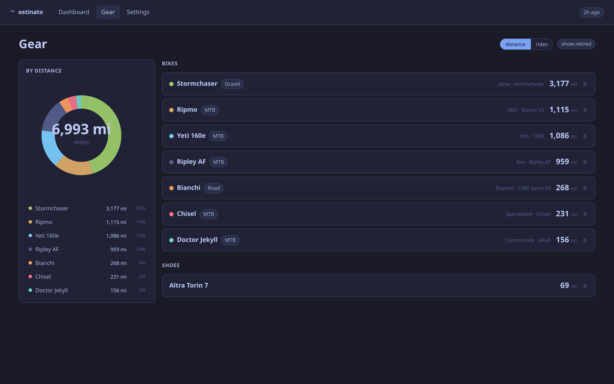
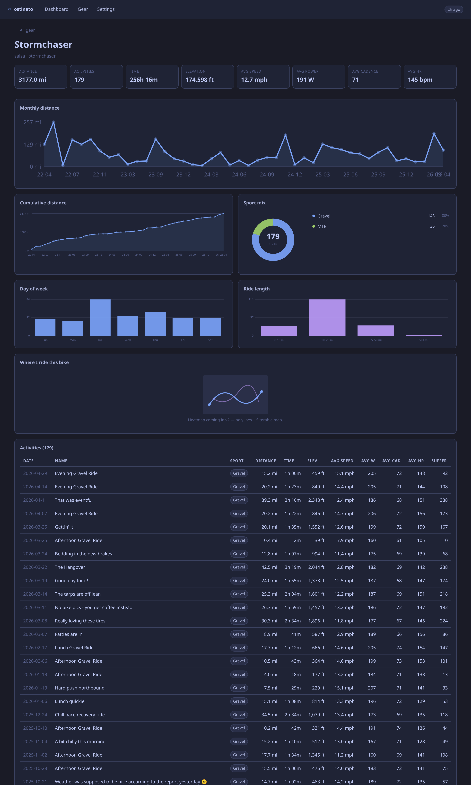
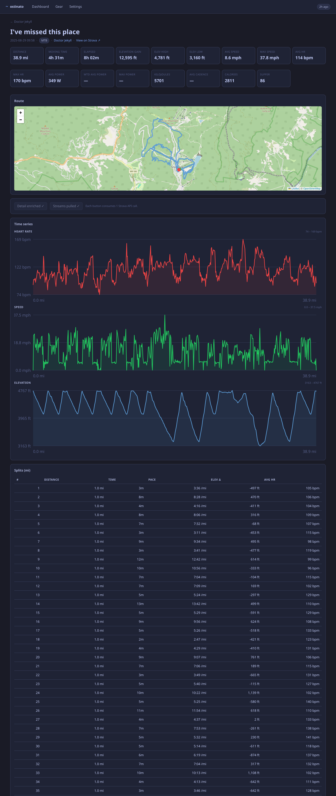

# ostinato

> Personal cycling + running viz that asks Strava the questions Strava can't.



> [!IMPORTANT]
> **`main` is the active development branch.** It may break at any time.
> For a deployment you can trust, install from the [latest
> release](https://github.com/awall451/ostinato/releases/latest) or pull
> the `:latest` image tag from GHCR:
> ```bash
> docker pull ghcr.io/awall451/ostinato:latest
> ```
> The `:edge` tag tracks every commit to `main`; pin to `:vX.Y.Z` if you
> want immutability.

An *ostinato* is a musical motif that repeats. Same routes, different bikes,
over and over.

## Why

Strava's dashboards lump every bike together, mislabel mountain-bike rides as
generic `Ride`, and don't surface per-bike year-over-year. ostinato is a
single-user, multi-source viz layer (Strava now, Garmin later) that mirrors
the Strava API into a local SQLite DB and renders pure-SVG charts on top.

Generic `Ride` activities are routed to MTB / Gravel / Road by `gear.frame_type`
at the view boundary, so a 38-mile day at Snowshoe doesn't get filed under
"Road".

## Quick start

```bash
cp .env.example .env
# fill STRAVA_CLIENT_ID + STRAVA_CLIENT_SECRET from https://www.strava.com/settings/api
# Strava "Authorization Callback Domain" = localhost (bare, no scheme/port/path)

docker compose up --build -d
# open http://localhost:5173/settings → Connect Strava → Backfill all summaries
```

For local dev with HMR:

```bash
npm install
npm run db:migrate
npm run dev   # http://localhost:5173
```

See [CLAUDE.md](CLAUDE.md) for the full dev workflow, container internals,
TDD loop, and Strava API gotchas.

## Tour

### Dashboard


Donut + stacked-bar + line-area, with range / metric / bucket toggles
(`30d / 90d / 6mo / 1y / 2y / all` × `count / distance / time` ×
`week / month / year`). Empty buckets render as a 2-pixel stub so the x-axis
stays honest across all data shapes.

### Gear



Sticky donut on the left, collapsible bike rows on the right. Toggle
`distance ↔ rides`; per-bike colors stay stable when retired bikes appear or
disappear. Click a row to expand inline. `?retired=1` adds retired bikes plus
a "no longer on Strava" ghost section for bikes that were deleted upstream.

### Per-bike detail



Per-bike stats grid, monthly distance, cumulative distance, sport mix donut,
day-of-week bars, and ride-length histogram. Single-sport bikes get a friendly
count line instead of a one-slice donut.

### Activity drill-down



17 stat cards, Leaflet route map from Strava's polyline, and per-second
heart-rate / power / cadence / speed / elevation streams (downsampled to keep
SVG node count under 600). Splits + segment efforts table render below.

## Stack

- **SvelteKit 5** (runes) + TypeScript
- **Drizzle ORM** + better-sqlite3 (Postgres-portable: integer epoch seconds,
  `INTEGER` booleans, no SQLite-isms)
- **Pure inline SVG** charts — no chart library
- **Distroless single-image container** (auto-migrates on boot, runs as nonroot)

## Roadmap

- **v2** — personal heatmap of activity polylines (filterable by gear / sport);
  HR / power / cadence dashboards on activity detail; per-bike power curve,
  cadence distribution, speed histogram on `/gear/[id]`
- **v3** — Garmin Connect ingest (third-party, no official API); public hosting
  with HTTPS reverse proxy + multi-user auth; Strava webhook subscriptions for
  push-sync

---

This product uses the Strava API but is not endorsed or certified by Strava.
Powered by [Strava](https://www.strava.com).
